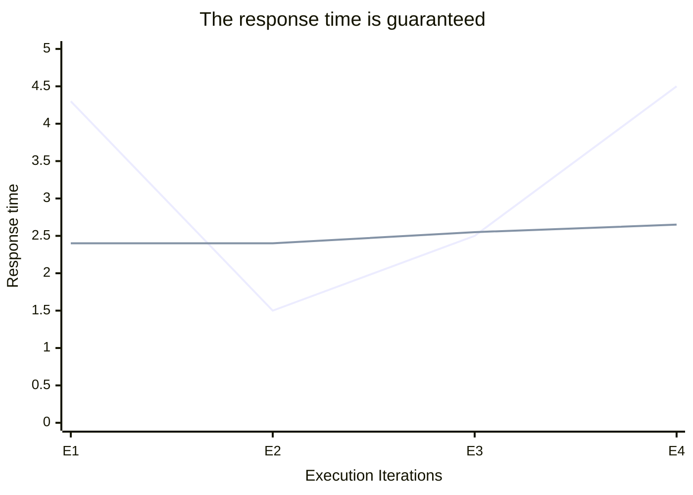

# What is Real Time Application(RTAs) ??

## 1. RTOS Introduction & Real Time Applications:
- Real time applications are not about `fast computing`, it is more about `predictable computing`.

```text

    Real Time Application != Fast Computing

    Real Time Application == Predictable Computing

```

- Real Time deals with `Guarantees`, not with Raw Speed or Promises.

- The Task should meet the `Deadline` instead of the `Timeline`, when we talk about the `Raw Speed`.

- Having more processors, more storage like RAM, faster bus interfaces doesn't make the system real time.

- If an application with limited hardware resources is able to meet a timeliness execution, then that system or application is called Real Time System.

---

## 2. What does Real Time System Signify?
- Real Time System signifies the system in which the correctness of the computation not only depends upon the logial correctness of the computation, but also upon the time at which the result is produced.

```text
    Real Time System = Logically Correct Computation + Timely Execution of the Task
```

- If the System does not perform the `logically correct computation` or the `timing constraints are not met` the system failure is said to have occured.

---

## 3. Response Time in Real Time Application
- The response time in the Real Time Application is guaranteed, it is not in the case of the Non Real Time Application.

- The Non Real Time Application cannot be trusted when the response time is concerned, it keeps varying between different iterations.

### Blue = Non-RTA | Green = RTA



---


## 4. Summarizing the Real Time Application
- `Real Time Applications` are `not fast executing applications`.

- `Real Time Applications` are `time deterministic` applications, that means, their `response time` to events is `almost constant`.

- There could be a `small deviation` in Real Time Application's response time in `ms or seconds` which will fall into the category of `Soft Real Time Applications`.

- `Hard Real Time Applications` must complete within a given time limit, failure to do so will result in absolute failure of the system.

---

## 5. Hard Real Time Application
- Air Bag triggering mechanism in the car is the example of the `Hard Real Time Application`.
- Air Bag deployment should be done in the given time limit of an impact, since the response falling outside of this limit can result in the driver sustaining injuries that could be avoided otherwise.
- Missile Guidance and Control System.
- Anti-Lock Breaking System.

## 6. Soft Real Time Application
- These are not as strict as Hard Real Time Applications like UPI payments, there can be a small delay of milliseconds that would not affect the system.
- Stock Market Website.

---

## 7. Examples of Hard and Soft Real Time Applications
## Aerospace
- Fault Detection(Hard)
- Aircraft Control(Hard)
- Display Screen(Soft)

## Finance
- ATMs(Hard)
- Stock Market Website(Soft)

## Medical
- CT Scan(Hard)
- MRI(Hard)
- Blood Extraction(Soft)
- Surgical Assist(Soft)

## Industrial
- Robotics(Hard)
- DSP(Hard)
- Temperature Monitor(Soft)

## Communication
- Audio/Video Streaming(Soft)
---