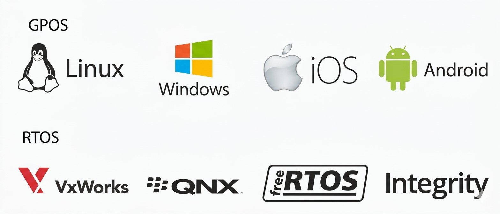
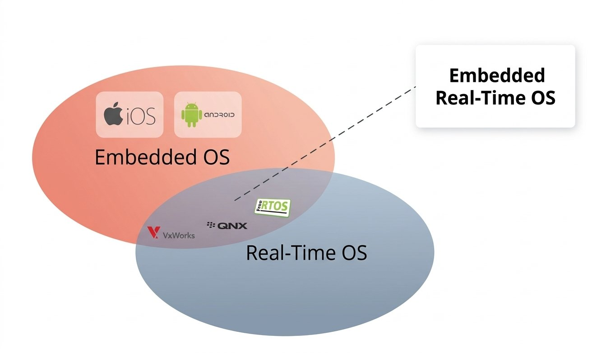

# What is Real Time Operating System(RTOS) ?
- **Time Deterministic** - Response time to events is always almost constant.
- You can always trust RTAs in terms of its timing in responding to events.

## 1. How to Run Real Time Applications?
- Real Time Applications `cannot` run on General Purpose OS like `Windows or Linux` etc. because they never help to meet the timing requirement.

- Real Time Operating System(RTOS) is required to achieve time deterministic requirements.

## 2. What is RTOS?
- It is an `Operating System` specially designed to run applications with very precise timing and a high degree of reliability.

- To be considered as `real time` an operating system must have a `known maximum time` for each of the critical operations that it performs.

- Some of these operations include:
  - Handling of interrupts and internal system exceptions.
  - Handling of critical sections.
  - Scheduling Mechanisms, etc.

- In the RTOS environment the Interrupt Latency is kept as minimal as possible as compared to GPOS Environment.

- In the RTOS environment there is not huge critical section code segment where interrupts of the system is turned off.

- In the RTOS environment scheduling mechanism of the RTOS is very simple, and most of the time favours the high priority task.

## 3. GPOS Examples
1.  Linux
2. Windows
3. iOS
4. Android

## 4. RTOS Examples
1. `VxWorks`
  - Win Driver
  - License is required

2. `AzureRTOS`
  - Microsoft
  - License is required

3. `FreeRTOS`
  - It is from FreeRTOS.org
  - It comes in two flavours namely `OpenRTOS` and `SafeRTOS`.

4. `QnX`
  - Used in Industrial Automation Application Medical and Robotics.

5. `Integrity`
  - It is from the Green Hills software majorly used for security and safety related applications.

## 5. NOTE:
- The `Mobile Operating Systems` like `iOS` and `android` may `not` fall into the category of `Embedded Real Time OS`.

