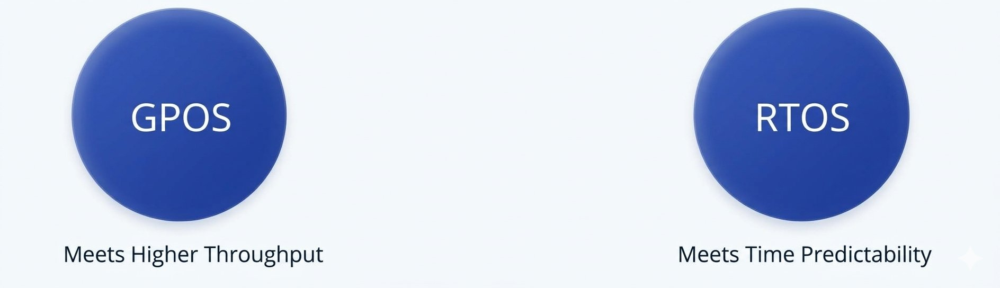

# RTOS vs GPOS ft. Task Scheduling

## 1. GPOS Task Scheduling
- `GPOS` is programmed to handle scheduling in such a way that it manages to achieve `High Throughput`.

$$
Throughput = \frac {Total\ number\ processes\ that\ complete\ their\ execution}{Total\ Elapsed\ Time}
$$

- To achieve high throughput if there are 5-6 low priority tasks waiting to be executed first, sometimes high priority tasks are avoided which are less in number.

- So, if 5 or 6 low priority applications are waiting to run, then the GPOS may delay 1 or 2 high priority task in order to increase the throughput.

- In `GPOS`, the scheduler typically uses a `fairness policy` to dispatch threads and processes onto the CPU.

- Such a policy enables the `high overall throughput` required by the desktop and server applications, but offers no guarantee that high-priority, time critical threads or processes will execute in preference to lower priority threads.

## 2. RTOS Task Scheduling
- `RTOS executes threads` in the order of their `priority`.

- If a high priority thread becomes ready to run, it will take over the CPU from any lower priority thread that may be executing.

- Here a high priority thread gets executed over a low priority ones.

- All "low priority thread execution" will get paused. A high priority thread execution will override only if a request comes from an even high priority threads.

## 3. Throughput comparison GPOS vs RTOS
- RTOS applications may yield less throughput than the GPOS applications because it always favours the high priority task to execute first.

- It does not mean that the RTOS applications have a very low throughput.

- These two operating systems are used in a entirely different scenarios, the GPOS is loaded with heavy processes and more processes.

- But a real time operating system most of the times is loaded with less number of tasks. So, a throughput is actually relative to the load of the system.

- A Quality RTOS will still deliver a decent overall throughput but can sacrifice throughput for being a deterministic or time predictability.

## 4. Summary
- For a RTOS, achieving the predictability or time deterministic nature is more important than throughput, but for the GPOS achieving higher throughput for user convenience is more important.

