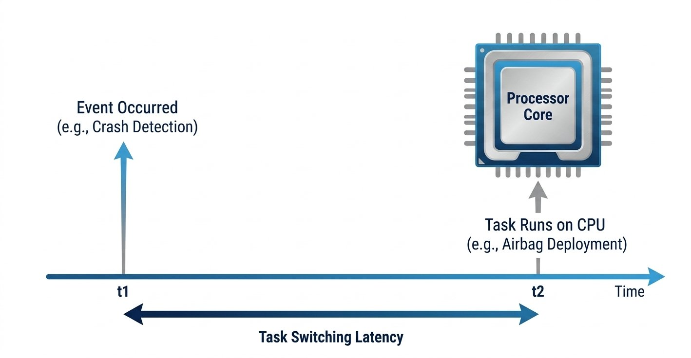
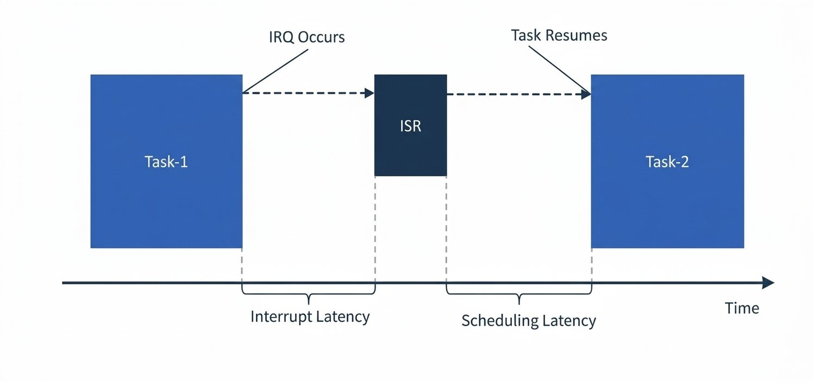

# RTOS vs GPOS ft. Latency

## 1. Defining Latency and Task Switching Latency
- `Latency` - The time that elapses between a stimulus and the response to it is called the Latency.

- `Task switching latency`- It is the time delay between when an event happens and when the computer actually starts running the task to handle it.

- Think of it like the reaction time between a traffic light turning green and your foot pressing the gas pedal.

- Example:
  - At t1 the Car Crashes (Event Occurs)
  - At t2 the Air Bag Deployment Happens (Task is made to run on the CPU)

The time between the t1 and t2 is called `Task switching latency`.

  

## 2. RTOS vs GPOS Latency and Task Switching Latency
| No. | Operating System Type | Latency                                       |
| --- | --------------------- | --------------------------------------------- |
| 01. | GPOS                  | Significantly Varies                          |
| 02. | RTOS                  | Almost Constant (Does not vary significantly) |

- The RTOS helps the user to design such type of systems, where this gap is deterministic and time bounded.

- No matter when the event occurs, this gap is always constant.

<!-- Fixed Y-Axis Label -->

  Task Switching Time (Latency)

<!-- Graph Canvas Box -->

<!-- RTOS Line (Constant/Flat) -->

RTOS

<!-- GPOS Line (Linear Increase) -->
<svg style="position: absolute; top: 0; left: 0; width: 100%; height: 100%;" xmlns="http://w3.org">
<line x1="0" y1="220" x2="100%" y2="30" stroke="#007bff" stroke-width="4" stroke-dasharray="8 4"><line/>
</svg>
GPOS

<!-- X-Axis Label -->

  System Load (Tasks)

## 3. RTOS vs GPOS: Interrupt Latency
- Interrupt latency is the time when the IRQ triggers till the time the ISR starts executing.

- This interrupt latency is a important parameter to service the critical events.

- In `Hard Real Time Applications` like `Air Bag Deployment` this Interrupt Latency should be in ns or milliseconds.

- The RTOS should have this latency as minimal as possible, but in GPOS this system gap varies as system load increases as it is unbounded.

- When the ISR finishes, the CPU has to make a switch to the higher priority task which is ready.

- At this time either the same task resumes i.e. Task 1 or the Task 2 will now run.

## 3. RTOS vs GPOS: Switching Latency
- This switching time is called as the Scheduling Latency(Time taken for the Context switching operation).

- This scheduling latency is also very narrow for the Real Time Applications.

- `Conclusion` - Both the interrupt and scheduling latency of the RTOS is as small as possible and time bounded. But in the case of the GPOS, due to the increase in system load these parameters may vary significantly.