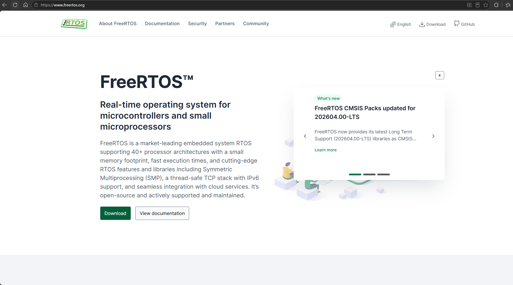

# Downloading FreeRTOS kernel source

## 1. Workspace folders
- Create a `Workspace` folder in the repo directory.
- Under `Workspace`, create two empty folders:
	- `FreeRTOS Workspace`: Used for the FreeRTOS exercises and projects.
	- `Software & Toolchain`: Used for downloaded software and toolchains.

---

## 2. Downloading FreeRTOS Kernel
- Visit [freertos.org](https://www.freertos.org/).

- Click the option `Download` to download the `FreeRTOS Kernel`.
- The kernel package contains the FreeRTOS kernel source code and example projects.
- Extract the downloaded package into the software and toolchain folder.
- We will be using the `FreeRTOSv202604.01 LTS(Latest)`.

### FreeRTOS Kernel package contents
- `FreeRTOSv202604.01-LTS\FreeRTOS\FreeRTOS-Kernel`: the FreeRTOS kernel directory.
	- `\FreeRTOS-Kernel`: architecture-independent kernel source files.
	- `\FreeRTOS-Kernel\include`: the associated header files.
	- `\FreeRTOS-Kernel\portable`: architecture- and compiler-specific code.
- `\FreeRTOS-Plus-TCP`: additional middleware, including command-line interface libraries and networking-related stacks such as TCP/IP and MQTT.
- Demo projects for different microcontrollers.
- A license directory containing the licensing information.

---

## Portable code
- The `\FreeRTOS-Kernel\portable` directory contains code specific to processor architectures and compilers.
- The `\FreeRTOS-Kernel\portable\GCC` directory contains ports for different processor architectures.
- The kernel `\FreeRTOS-Kernel` directory contains the architecture-independent code, while the portable directory contains the architecture-specific code.
- We will be discussing the architecture-specific code later.

---

## Licensing
- The FreeRTOS kernel is released under the `MIT` open source license.
- Review the FreeRTOS licensing terms when developing a commercial product using the kernel.

---

## Choosing a FreeRTOS version
- The FreeRTOS download page provides the latest kernel release and links to previous releases in the FreeRTOS GitHub repository.
- Newer versions may work, but they can be incompatible with tools or later steps used in this course.
- If problems occur with a newer release, try the course version, `FreeRTOSv202604.01`.

The next step is to create an STM32F407G-DISC1 Discovery board project and integrate the FreeRTOS kernel into it.
