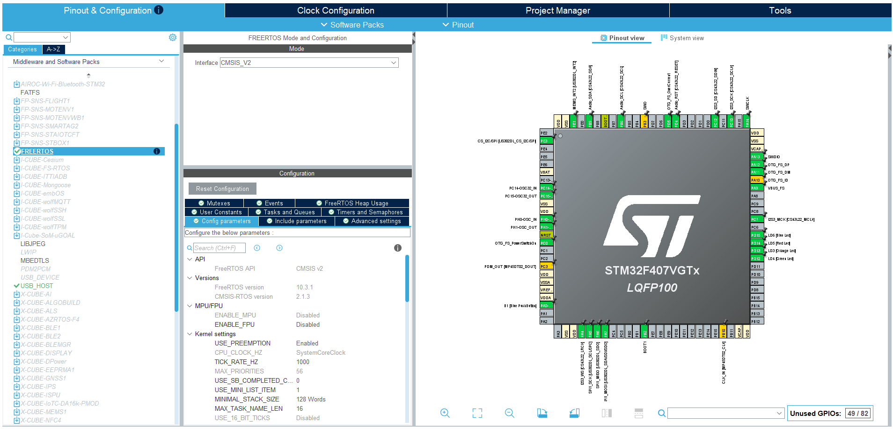
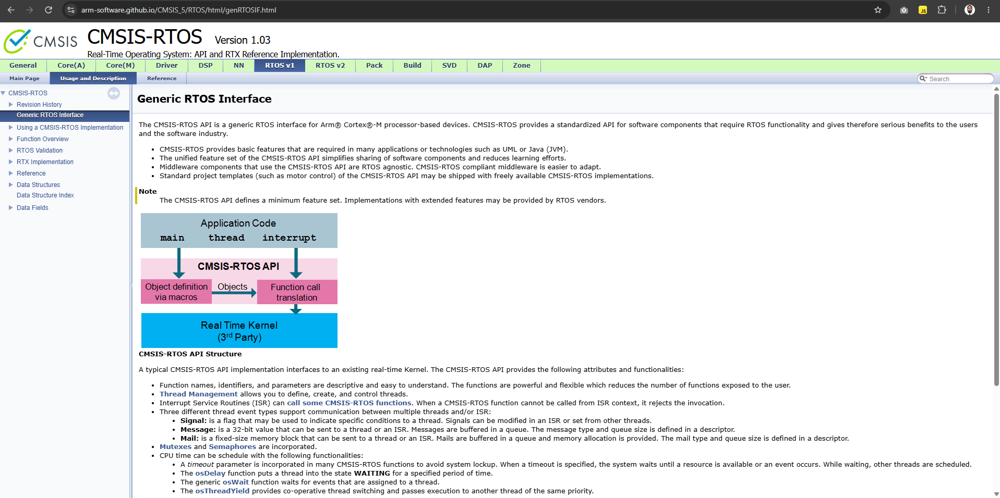
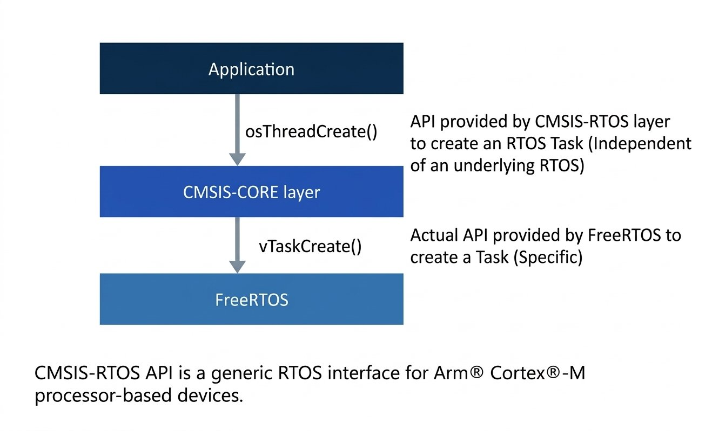
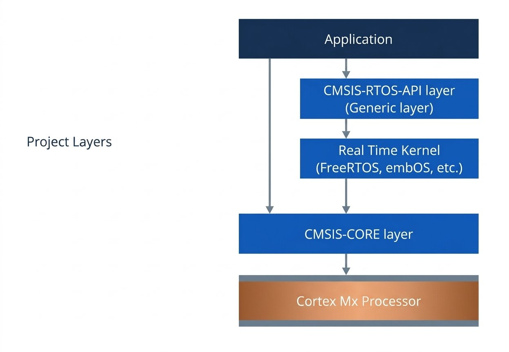

# 02. Adding FreeRTOS kernel source to project

## 1. Integration Methods
- The FreeRTOS kernel can be added to an STM32 project in two ways:
	1. **Manually** (Non CMSIS RTOS).
	2. **STM32Cube device configuration tool** (CMSIS RTOS).

- We will be using the manual method because it can be applied with different microcontrollers and IDEs.

- The device configuration tool can add FreeRTOS together with a CMSIS-RTOS API layer, but we will focus more on the native FreeRTOS APIs first.

## 2. FreeRTOS and CMSIS-RTOS
- CMSIS-RTOS is a generic RTOS interface for ARM Cortex-M processor-based devices.
- It provides standardized APIs between the application and the underlying RTOS kernel.
- For example:
	- An application can use the generic `osThreadCreate` API.
	- The CMSIS-RTOS layer can map it to the FreeRTOS-specific `vTaskCreate` API.
- We will call the `FreeRTOS APIs directly` and and will not add the `CMSIS-RTOS API layer`.

####  STM32Cube Device Configuration Tool i.e. CubeMX (CMSIS RTOS API Included)

- `FreeRTOS Kernel source` can be selected by a single click using **STM32CubeMX**.

- CMSIS RTOS API is a generic RTOS interface for Arm Cortex-M processor based device.

- Other vendors other than STMicroelectronics do not provide such softwares to add the FreeRTOS Kernel.

- For M33 Non Secure only the CMSIS_V2 is available and CMSIS_V1 is not available.

#### CMSIS RTOS API Layer

- Real Time Kernel(3rd party) can be FreeRTOS, Embos, AzureRTOS etc.

### Advantages of the CMSIS-RTOS API Layer:
- CMSIS-RTOS API Layer exposes general API's.

- Application is independent of the Real Time Kernel Layer.

- Re-entrant means that the functions can be re-entered in the middle of execution and safely called again before the previous executions are complete.

- Multiple tasks should call the functions in their own space, it should be enabled, to make the multithreaded functions safe to use.

## 3. Add the Kernel Source Manually
1. In the STM32CubeIDE project, right click the project, click on `Source Folder`.
2. Give the name as `ThirdParty` and click on `Finish`.
3. In the project location, create a `FreeRTOS` folder inside `ThirdParty`.
4. From the extracted `\FreeRTOSv202604.01-LTS\FreeRTOS\FreeRTOS-Kernel\`, copy the files `timers.c`, `croutine.c`, `event_groups.c`, `list.c`, `queue.c`, `stream_buffer.c`, `tasks.c` into `ThirdParty\FreeRTOS`.
5. From the extracted `\FreeRTOSv202604.01-LTS\FreeRTOS\FreeRTOS-Kernel\`, copy the `\License.md` and `\include\` folder into `ThirdParty\FreeRTOS`.
6. From the extracted `\FreeRTOSv202604.01-LTS\FreeRTOS\FreeRTOS-Kernel\`, copy the `\portable` folder into `ThirdParty\FreeRTOS`.

## 4. Keep the Correct Port
- From the `ThirdParty\FreeRTOS\portable` directory remove compiler ports that are not used by the project.
- Keep only the `GCC` port and its `MemMang` and `readme` entries, delete all the others.
- The `STM32F407G-DISC1` uses an ARM Cortex-M4 processor with floating-point support, so keep the `ARM_CM4F\` folder under `portable\GCC` and remove the other processor-architecture folders.
- The `ARM_CM4F\` folder contains the architecture-specific source and header files required by FreeRTOS.

## 5. Configure the Project Files
- Refresh the project in STM32CubeIDE so the new `FreeRTOS` folder appears.
- Open the `ThirdParty` folder properties and make sure **Exclude resource from build** is unchecked.
- In the project source files, exclude `sysmem.c` from the build because FreeRTOS provides its own heap-management implementation.
- Under `portable\MemMang`, keep only `heap_4.c` for this project and remove the other heap implementations.
- FreeRTOS provides multiple heap-management schemes, but only one heap implementation should be used.

## Build Result
- Build the project after adding the kernel source.
- The build reports that `FreeRTOS.h` cannot be found because the FreeRTOS header directory has not yet been added to the compiler include paths.
