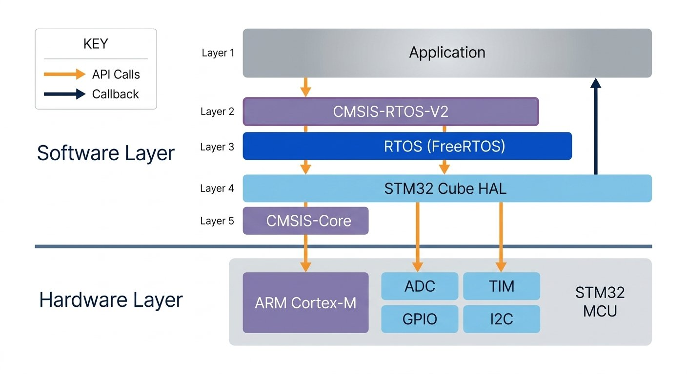

# Adding FreeRTOS to STM32 Project Using STM32CubeIDE's Graphical Interface

## 0. Create the Project using STM32CubeMX
1. Open the STM32CubeMX
2. Click on **Access to Board Selector**
3. In the Commercial Part Number type `STM32F407G-DISC1`
4. Click on Start Project.
5. Initialize all the peripherals in default mode - **Yes**

## 1. Configure the Project name and Project Location
1. Go to the **Project Manager** Tab.
2. Select STM32CubeIDE in **Toolchain / IDE** Dropdown.
3. Type the name of the project **01.Free RTOS Project**
4. Give the **Project Location** where the project has to be kept.

## 2. Enable FreeRTOS in STM32CubeMX
1. Open **Pinout and Configuration**.
3. Expand **Middleware and Software Packs** Section.
4. Select **FreeRTOS**.
5. Choose the CMSIS-RTOS interface version. We will use `CMSIS_V2`.

## 3. Change the HAL Time Base(System Core > SYS)
- STM32CubeIDE will give warning that an RTOS project should use a hardware-abstraction-layer time base other than `SysTick`.
1. Open **Pinout and Configuration**.
2. Go to **System Core > SYS**.
3. Change the **Timebase Source** from `SysTick` to another timer peripheral, such as `TIM6`.

## 4. Enable Newlib Reentrancy
1. In the **FreeRTOS configuration** inside the **Pinout and Configuration** tab, open **Advanced Settings**.
2. Enable the New-lib re-entrancy option.
3. New-lib is the standard C library used in our project.
4. There are two standard C libraries used in our project, one is newlib and other is Newlib-nano, New-lib nano is the memory reduced version of New-lib.
5. This feature enable the function to be interrupted in between and reentered again safely before the previous executions are complete.
6. This feature is important for the multi-threaded environment.

## 5. Generate Code
- Click on **GENERATE CODE** to generate the project code.
- Open the Project in the STM32CubeIDE

## 6. Result
- The graphical configuration interface is used to modify the generated FreeRTOS configuration items.
- The FreeRTOS configuration window provides tabs for kernel settings, including heap usage and other configuration parameters.
- STM32CubeIDE adds a middleware folder containing the FreeRTOS kernel and CMSIS-RTOS v2 layer.
- It also generates `FreeRTOSConfig.h` in the project's `Core/Inc` folder.
- STM32CubeIDE can link either Newlib or the memory-reduced Newlib Nano C library.
- In a multithreaded FreeRTOS application, library functions may be called concurrently by multiple tasks.
- Reentrant functions can be interrupted and safely called again before an earlier execution has completed.
- This enables thread-local storage so each task can use its own library data structures.
- After changing the HAL time base and enabling Newlib reentrancy, save and regenerate the project again.
- The application can use native FreeRTOS APIs or the CMSIS-RTOS API layer generated by the graphical integration.
