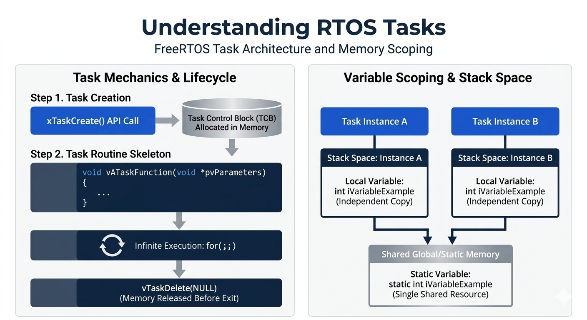

## What Is a Task?
- Examples of tasks in a day can be having breakfast, sending emails, calling someone, taking notes, etc.

- In an RTOS such as FreeRTOS, a task is a piece of code that is schedulable and implements a specific application function.

- For a temperature monitoring application, there can be three tasks:
  1. `Task 1`: Sensor data gathering
  2. `Task 2`: Updating the display
  3. `Task 3`: User input processing

- An application can be divided into multiple tasks, with the RTOS scheduling each task `periodically` or `aperiodically`.

## 1. Creating a Task
- Using a task in FreeRTOS requires two parts:

1. **Task creation**.
- Task creation creates the task in memory and allocates memory for its Task Control Block.

```c

/* 1. Task Creation */

BaseType_t xTaskCreate( TaskFunction_t pvTaskCode,
                        const char * const pcName,
                        unsigned short usStackDepth,
                        void *pvParameters,
                        UBaseType_t uxPriority,
                        TaskHandle_t *pxCreatedTask
                    );
```

2. **Task Implementation(Task Function)**

- It is the function which runs on the CPU.

- The task handler contains the instructions that implement the task's functionality.

- A task handler is a normal C function that receives one pointer parameter for passing the task's data i.e. `*pvParameters`.

- If the task doesn't implement infinite for loop or in any case if it breaks the for loop to go out of the task function, then task must be deleted before exiting the task function.

```c

/* 2. Task Implementation */


void vATaskFunction(void *pvParameters)
{
    /* Variables can be declared like we declare in a normal function. Each
    instance of a task created using this function will have its own copy of
    the iVariableExample variable. This would not be true if the variable
    was declared static - in which case only one copy of the variable would
    exist and this copy would be shared by each instance of the task. */
    int iVariableExample = 0;

    /* A task would normally be implemented in an infinite loop */
    for(;;)
    {
        -- Task application code here. --
        /* The code to implement the task functionality will go here */
    }

    /* Should the task implementation ever break out of the above loop then
    the task must be deleted before reaching the end of this function. The
    NULL parameter passed to the vTaskDelete() function indicates that the
    task to be deleted is calling (this task) */
    vTaskDelete(NULL);
}
```

## 2. Task Handler Rules
- A task handler is normally implemented as an infinite loop.
- The task functionality should be placed inside that loop.
- A task handler must not simply return when it finishes.
- If the handler needs to leave its loop, it must delete the task before reaching the end of the function.
- Passing `NULL` to `vTaskDelete()` deletes the calling task and releases the memory allocated for it during task creation.

## 3. Local and Static Variables
- Variables declared normally inside a task handler are local to each task instance.
- For e.g. `iVariableExample` is created in `stack space` of the task.
- If two tasks use the same handler, each task has its own copy of a local variable in its `task stack`.
- A variable declared with `static` has only one shared copy when the handler is used by multiple tasks.
- Static variables therefore become shared resources between those task instances.

```c
     /* Separate copy of the variable is created in there own stack space */
    int iVariableExample = 0;

    /* This variable will be shared variable between the two task if the variable is static */
    static int iVariableExample = 0;
```

## 4. Key Points
- A task is schedulable code that implements one application function.
- Task creation and task implementation are separate steps.
- Task handlers generally run in an infinite loop.
- A task handler must delete its task before returning.
- Local variables are per-task, while static variables are shared by task instances using the same handler.

