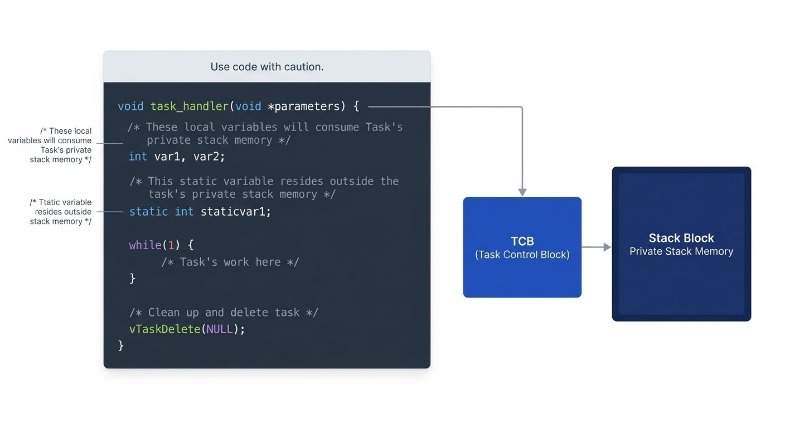

# Exercise 001 coding

## 1. Write an application that creates 2 Tasks, Task-1 and Task-2 of equal priorities to print the message 'Hello World from Task-x'

### 1. Prepare the Project
- Create a new Project with the steps discussed previously and name the project `02.Tasks` in STM32CubeIDE.

### 2. Include the Paths
- Include the following paths in the include paths:
```bash
../ThirdParty/FreeRTOS/portable/GCC/ARM_CM33_NTZ/non_secure
../ThirdParty/FreeRTOS/include
```
- Copy the contents of the reference `FreeRTOSConfig.h` file into the project's `FreeRTOSConfig.h` file.

### 3. `USER CODE` Blocks — Why They Matter
- `main.c` is regenerated whenever the STM32Cube device-configuration tool (CubeMX) is used to change pin/peripheral/clock configuration.
- If application code is written **outside** the `/* USER CODE BEGIN ... */` / `/* USER CODE END ... */` marker pairs, the code-generation engine can silently delete it on the next regeneration.
- Rule: always place custom code **inside** the appropriate `USER CODE BEGIN` / `USER CODE END` block for that section (includes, private variables, function prototypes, body of `main()`, etc.) — never outside them.

### 4. Include FreeRTOS Headers
- In the `/* USER CODE BEGIN Includes */` ... `/* USER CODE END Includes */` block of `main.c`, include:
```c
#include "FreeRTOS.h"
#include "task.h"
```
- `task.h` provides the FreeRTOS task APIs, including `xTaskCreate()`.

### 5. Create Two Tasks
- Create two task handles using `TaskHandle_t`:

```c
/* USER CODE BEGIN PV */
TaskHandle_t task1_handle;
TaskHandle_t task2_handle;
/* USER CODE END PV */
```

- Declare a `BaseType_t` variable to capture the return status of each `xTaskCreate()` call (its return type is copied straight from the API signature).
- Call `xTaskCreate()` for each task from `main()`, inside `/* USER CODE BEGIN 2 */` ... `/* USER CODE END 2 */`, after the required HAL/clock initialization.

```c
BaseType_t status;

status = xTaskCreate(task1_handler, "Task-1", 200, "Hello World from Task-1", 2, &task1_handle);
configASSERT(status == pdPASS);

status = xTaskCreate(task2_handler, "Task-2", 200, "Hello World from Task-2", 2, &task2_handle);
configASSERT(status == pdPASS);
```
- A single reused `status` variable (as shown above and used in the lecture) is fine here since each `configASSERT()` check happens immediately after its corresponding call.

- Values used for both tasks:
	- Stack depth: `200` words → `200 * 4 = 800` bytes on this 32-bit target (word = 4 bytes).
	- Priority: `2` (equal priority for both tasks, as required by the exercise).
	- Task names: `Task-1` and `Task-2`.
	- Parameters: `"Hello World from Task-1"` / `"Hello World from Task-2"` — each a `const char *`, passed via `pvParameters` and received as `void *` in the handler.
	- Output handles: `&task1_handle`, `&task2_handle`.

#### Understanding `configASSERT()`
- `configASSERT()` is defined in `FreeRTOSConfig.h` as an ordinary C macro taking one argument, `x`.
- Conceptually, it expands to something like:
```c
#define configASSERT(x)  if ((x) == 0) { taskDISABLE_INTERRUPTS(); for (;;); }
```
- If the expression `x` evaluates to `0` (false), the code disables interrupts and traps in an infinite loop right there.
- If `x` is non-zero (true, e.g. `status == pdPASS` holds), the macro does nothing and execution continues normally.
- This is a debugging aid: if execution halts in that infinite loop while stepping through the debugger, it tells you the preceding condition failed — narrowing down exactly where something went wrong.

### 6. Define the Task Handlers
- Define `task1_handler` and `task2_handler` in the private user-code section, near the end of `main.c`.

```c
/*
 * This task handler takes a void* pointer because the data passed
 * into Task 1 has no fixed type at this stage. The function returns
 * nothing. It is static because its scope is limited to this file only.
 */
static void task1_handler(void *parameter)
{

}

/*
 * This task handler takes a void* pointer because the data passed
 * into Task 2 has no fixed type at this stage. The function returns
 * nothing. It is static because its scope is limited to this file only.
 */
static void task2_handler(void *parameter)
{

}
```

- Each handler returns `void` and receives one `void *` parameter for the task argument.
- Declare the handlers as `static` since they are private to `main.c`.
- Add their prototypes in the user private function-prototypes section (marked `PFP` — Private Function Prototypes):

```c
/* USER CODE BEGIN PFP */
static void task1_handler(void *parameter);
static void task2_handler(void *parameter);
/* USER CODE END PFP */
```

- The task handlers are created in this exercise but are not yet scheduled — that happens once the scheduler is started, in a later lecture.

### 7. Putting It Together (in `main()`)
```c
/* USER CODE BEGIN Includes */
#include "FreeRTOS.h"
#include "task.h"
/* USER CODE END Includes */

/* USER CODE BEGIN PFP */
static void task1_handler(void *parameter);
static void task2_handler(void *parameter);
/* USER CODE END PFP */

/* USER CODE BEGIN PV */
TaskHandle_t task1_handle;
TaskHandle_t task2_handle;
/* USER CODE END PV */

int main(void)
{
  /* MCU / HAL initialization, clock config, peripheral init ... */

  /* USER CODE BEGIN 2 */
  BaseType_t status;

  status = xTaskCreate(task1_handler, "Task-1", 200, "Hello World from Task-1", 2, &task1_handle);
  configASSERT(status == pdPASS);

  status = xTaskCreate(task2_handler, "Task-2", 200, "Hello World from Task-2", 2, &task2_handle);
  configASSERT(status == pdPASS);
  /* USER CODE END 2 */

  /* Scheduler start (vTaskStartScheduler()) is covered in the next lecture */

  while (1)
  {
  }
}

/* USER CODE BEGIN 4 */
static void task1_handler(void *parameter)
{

}

static void task2_handler(void *parameter)
{

}
/* USER CODE END 4 */
```
- Build the project after adding this code to confirm it compiles cleanly.

### 8. What Task Creation Does, Internally
- The task-management logic lives in the kernel source file `tasks.c`.
- Inside `xTaskCreate()`, at a conceptual level:
  1. It first dynamically allocates memory (via `malloc`) for the task's **private stack**.
  2. If that allocation succeeds, it makes a second `malloc` call to allocate memory for the **Task Control Block (TCB)** — the kernel's internal data structure representing the task.
  3. The newly allocated stack is then linked to that TCB.
  4. If either allocation fails (insufficient heap), `xTaskCreate()` returns an "insufficient memory" error code instead of creating the task — this is the **only** way task creation can fail.
  5. On success, the new TCB is inserted into the kernel's **ready list** via an internal call (something like `AddTaskToReadyList`), which is implemented using the kernel's generic list-management code in `list.c`.
- The kernel maintains separate lists for other task states too — e.g., blocked tasks, suspended tasks — not just the ready list.
- Later, once the scheduler runs, it picks a TCB from the ready list and makes that TCB's associated task handler function execute on the CPU.

### 9. Stack Usage Consideration
- Local variables declared inside a task handler are stored in that task's **private stack**, not shared, general-purpose RAM.
- Large local arrays or many local variables increase stack consumption and can lead to **stack overflow** — be careful about declaring big local arrays inside a task handler.
- **Static** variables are *not* stored in the task's private stack — they live elsewhere in RAM (covered in more detail later).

