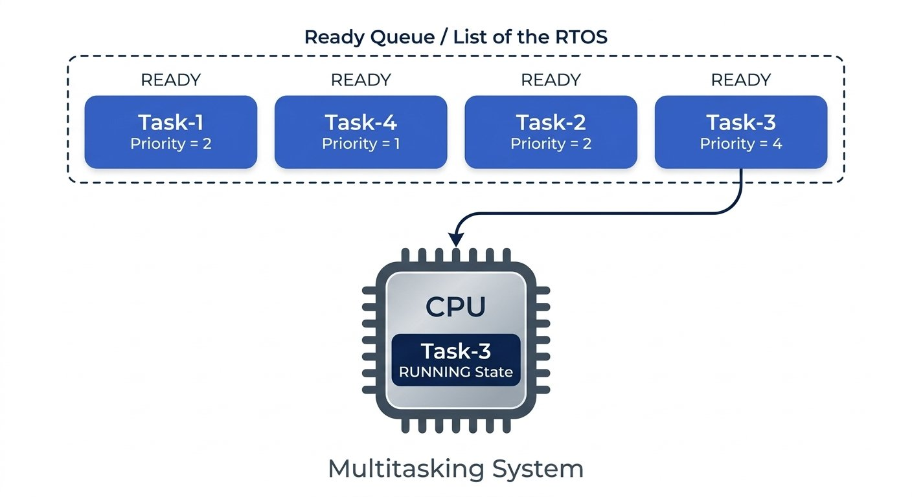
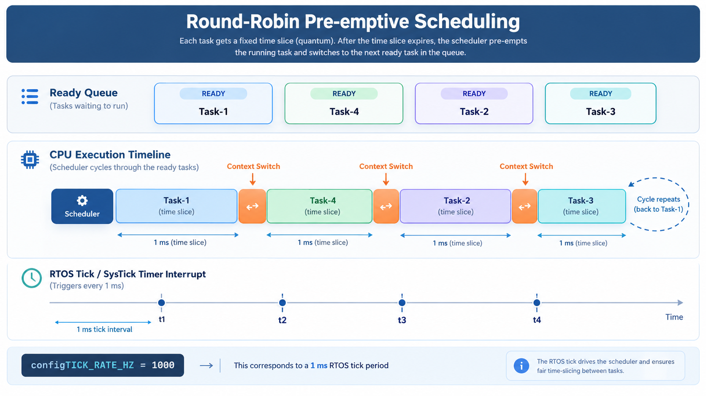
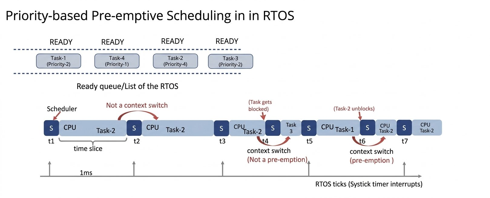
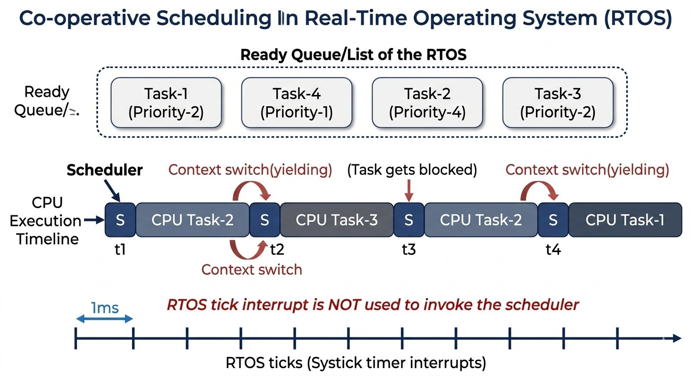

# Scheduling policies

- We now have 2 created tasks, which are in the `Ready Task List` of FreeRTOS (`READY` state).
- Tasks will be dispatched to run on the CPU by the scheduler (`RUN` state).
- `Scheduler` is a `piece of code` that is part of the FreeRTOS kernel, which runs in the `privileged mode of the processor`.



## 1. Start the Scheduler
- Tasks created with `xTaskCreate()` are placed in the ready list of FreeRTOS (`READY` state), but they do not run until the scheduler is started.
- The scheduler is part of the FreeRTOS kernel and runs in the processor's privileged mode.
- The scheduler is invoked with the below API provided by FreeRTOS:

```c
/* Scheduler which schedules the tasks */
vTaskStartScheduler();
```

> **Background (not from the lecture, but standard FreeRTOS behavior):** when `vTaskStartScheduler()` is called, the kernel also automatically creates a low-priority **Idle Task** and adds it to the ready list. The idle task runs whenever no application task is ready, and is also responsible for freeing memory of tasks that have deleted themselves. `vTaskStartScheduler()` does not normally return — control passes to the scheduler and application tasks from this point on. It only returns if there wasn't enough heap memory to create the idle task (and, if enabled, the timer-service task).

## 2. Scheduling Policy
- The scheduler schedules tasks to run on the CPU according to the scheduling policy configured:
  1. Pre-emptive Scheduling
  2. Co-operative Scheduling
- The `configUSE_PREEMPTION` setting in `FreeRTOSConfig.h` selects the scheduling mode:

```c
// FreeRTOSConfig.h
#define configUSE_PREEMPTION   1   // 1 = pre-emptive scheduling (default)
                                    // 0 = co-operative scheduling
```

- FreeRTOS supports both pre-emptive and co-operative scheduling.

## 3. Pre-emptive Scheduling
- **Pre-emption** is the forced replacement of a running task by another task, even when the running task has not completed its work.
- The running task is made to give up the processor even if it hasn't finished the work.
- The scheduler does this to give another task in the application a chance to run — the scheduler is in charge of scheduling all tasks.
- The pre-empted task simply returns to the `Ready` state, unless it has become `Blocked` or `Suspended`.
- FreeRTOS supports two common forms of pre-emptive scheduling:
	1. `Round-robin (Cyclic) scheduling`
	2. `Priority-based scheduling`

### 3.1. Round-Robin Scheduling
- Ready tasks run in a cycle, with each task receiving a fixed time slice, also called a **time quantum** (e.g. 1 ms or 2 ms — application-dependent, and configured in the kernel).
- When a task's time slice expires, the scheduler pre-empts it and performs a **context switch** to the next ready task.
- A context switch saves the current task's execution context and restores the next task's context. *(What exactly a task's "context" contains is covered in a later lecture.)*
- After the last ready task runs, the cycle wraps back around to the first task.

**Example walk-through (4 ready tasks — Task-1, Task-2, Task-3, Task-4):**

| Time window | Task running | What happens at the boundary |
|---|---|---|
| t1 → t2 | Task-1 | Scheduler picks the first ready task, Task-1, to run |
| t2 → t3 | Task-4 | Task-1's time slice ends; scheduler pre-empts it and dispatches the next ready task |
| ... | Task-2, Task-3 | Cycle continues through the remaining ready tasks |
| after Task-3 | Task-1 (again) | Cycle wraps back to the first task |

- The scheduler itself runs periodically, once per **RTOS tick** (see Section 4).



### 3.2. Priority-Based Scheduling
- Tasks are scheduled to run on the CPU based on their priority value — a higher priority value means a higher-priority (more urgent) task.
- A higher-priority task will keep running on the CPU (across successive time slices) unless it gets deleted, blocked, suspended, or voluntarily yields — the scheduler always keeps re-selecting the **highest-priority ready task**.
- If the highest-priority task is still ready when its time slice expires, the scheduler simply continues running it — a time-slice expiry does not automatically bring in a different task in priority-based scheduling.
- If that task blocks while waiting for an event, the scheduler selects the next-highest-priority ready task.
- If a higher-priority task becomes unblocked while a lower-priority task is running, the scheduler pre-empts the lower-priority task immediately.
- A transition caused by a task entering the blocked state is **not** pre-emption — the task voluntarily leaves the CPU because it's waiting for an event. *(Blocking is covered in more detail later in the course.)*

**Example walk-through** (Task-2's priority > Task-1's and Task-3's, which share equal priority; Task-4 also lower priority):

| Time | Event |
|---|---|
| t1 | Scheduler picks Task-2 (highest priority) to run |
| t2, t3 | RTOS tick fires; no higher-priority task is ready, so Task-2 simply continues running |
| t4 | Task-2 **blocks**, waiting for an event → scheduler picks the next highest-priority ready task, Task-3. *(This is a context switch, but not a pre-emption — Task-2 left voluntarily by blocking.)* |
| t5 | RTOS tick fires; scheduler picks Task-1 (equal priority to Task-3) |
| t6 | The event Task-2 was waiting for occurs → Task-2 unblocks and the scheduler **immediately pre-empts** Task-1 (whose time slice hadn't expired) to run Task-2 right away |



> **Background (not from the lecture):** on the ARM Cortex-M family this course is targeting, the RTOS tick and the context-switch mechanism are typically implemented using two core exceptions:
> - the **SysTick** exception, which fires periodically (per Section 4) and drives the scheduler's tick-processing, and
> - the **PendSV** exception, which the kernel pends whenever an actual context switch needs to happen; PendSV runs at the lowest exception priority so it executes only after other interrupt handling has completed, keeping context switches from interrupting more urgent interrupt handlers.

## 4. RTOS Tick
- The scheduler runs periodically because of the **RTOS tick** interrupt.
- The RTOS tick is a timer interrupt that provides the time reference used for scheduling — any timer peripheral on the microcontroller can, in principle, be configured to issue this periodic interrupt.
- `configTICK_RATE_HZ` controls the RTOS tick frequency:

```c
// FreeRTOSConfig.h
#define configTICK_RATE_HZ   ((TickType_t)1000)   // default: 1000 Hz → tick every 1 ms
```

- With the default value of `1000`, the timer issues an interrupt — and the scheduler runs — every 1 millisecond.
- The timer used for the RTOS tick is configured according to the target hardware and project settings.

> **Background (not from the lecture):** on most official ARM Cortex-M FreeRTOS ports (including the `ARM_CM33_NTZ` port used in this course), the RTOS tick is generated by the core's built-in **SysTick** timer rather than a general-purpose peripheral timer, unless the port is explicitly configured otherwise. The reload value for SysTick is derived from `configCPU_CLOCK_HZ` and `configTICK_RATE_HZ` together.

## 5. Co-operative Scheduling
- A task cooperates with other tasks by explicitly giving up the processor — this is called **task yielding**.
- There is no pre-emption by the scheduler in this mode: a running task is never forcibly interrupted by the scheduler.
- The RTOS tick interrupt still occurs, but it doesn't cause the scheduler to swap tasks — the tick is still needed to keep the kernel's real-time tick count up to date.
- A task gives up the CPU either when it's done with its periodic work, or when it blocks/suspends waiting for a resource or event.
- Example: Task-2 (higher priority) runs from t1; at t2 it voluntarily yields, letting Task-3 run; at t4 Task-2 yields again, letting other tasks run. Tasks cooperate by sharing the CPU this way.

```c
/* A task can voluntarily give up the CPU using: */
taskYIELD();
```



## Key Points
- Call `vTaskStartScheduler()` after creating the tasks — it hands control to the kernel and does not normally return.
- `configUSE_PREEMPTION` selects pre-emptive (`1`, default) or co-operative (`0`) scheduling.
- `Round-robin scheduling` shares the CPU using fixed time slices, cycling through ready tasks.
- `Priority-based scheduling` always selects the highest-priority ready task; equal-priority tasks share the CPU round-robin style once the higher-priority ones are blocked or suspended.
- Blocking and pre-emption are different: blocking is a task voluntarily giving up the CPU while waiting for an event; pre-emption is the scheduler forcibly replacing a running task.
- `configTICK_RATE_HZ` sets the RTOS tick frequency (default `1000` Hz → 1 ms tick), which drives when the scheduler runs.
- Co-operative tasks must voluntarily yield the CPU (e.g. via `taskYIELD()`); the scheduler never pre-empts them.
- The kernel automatically creates an idle task when the scheduler starts, and (on Cortex-M ports) typically uses SysTick for the tick and PendSV for the actual context switch.