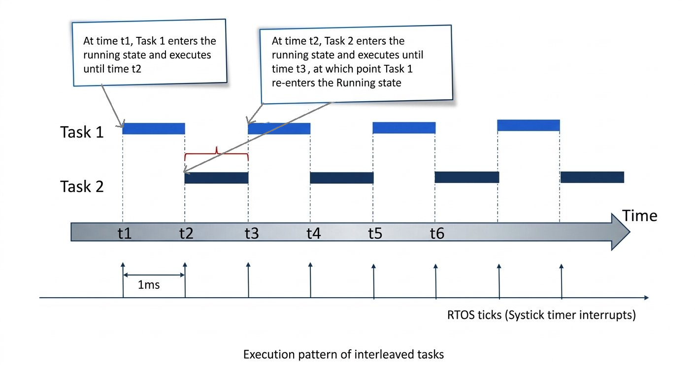
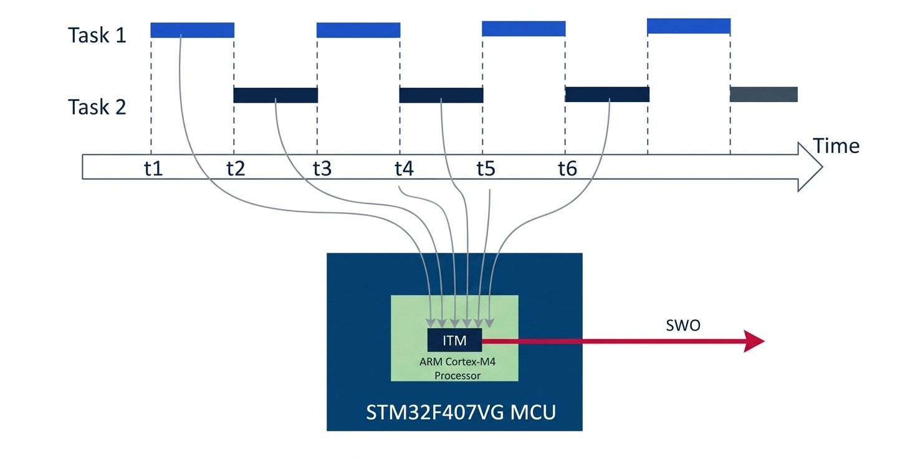

# Exercise 001 testing

## 1. Configure Debugging
1. Right-click the project in STM32CubeIDE and select **Debug As**.
2. Open the debugger configuration.
3. Select **SWD** as the debugging interface.
4. Enable **Serial Wire Viewer**.
5. Set the Core Clock to the processor clock used by the project.

## 2. Determine the Core Clock
- Open the STM32Cube device configuration tool and select **Clock Configuration**.
- In the lecture project, the system clock and HCLK are set to `25 MHz`.
- The Cortex-M processor clock (`FCLK`) and the SysTick input also run at `25 MHz`.
- Set the Serial Wire Viewer Core Clock to `25 MHz` and apply the debugger configuration.
- If STM32CubeIDE requests an ST-LINK firmware update, open the hardware in update mode and upgrade the firmware before reconnecting to the board.

## 3. View the ITM Output
1. Switch to the Debug perspective when prompted.
2. Resume execution so the program runs.
3. Open **Window > Show View > SWV > SWV ITM Data Console**.
4. Configure the console to listen on ITM port `0`.
5. Start the trace and run the application.
- The console may report that the trace buffer is full and that data is being discarded.
- Clear collected data before capturing another trace.

## 4. Why the Output Is Garbled
- The application contains two tasks with equal priority and an RTOS tick every `1 ms`.
- `configTICK_RATE_HZ` is set to `1000`, meaning `1000` RTOS ticks per second.
- With `configUSE_PREEMPTION` set to `1`, the scheduler can preempt the running task on each RTOS tick.
- If `Task 1` is interrupted while writing its message, `Task 2` can start writing to the same ITM resource before the first message is complete.



- The two tasks therefore race to use a shared output resource, causing their messages to become interleaved or unreadable.
- The output resource must be protected with a mutual-exclusion or semaphore mechanism so a task holds the resource until its complete message has been written.



## 5. Test Cooperative Scheduling
- Set `configUSE_PREEMPTION` to `0` in `FreeRTOSConfig.h` and rebuild the project.
- With preemption disabled, the running task does not get forcibly interrupted by the scheduler.
- Add `taskYIELD()` after each task finishes printing its message:

```c
taskYIELD();
```

- `taskYIELD()` voluntarily gives up the processor and allows another ready task to run.
- In this configuration, each task can finish writing its complete message before yielding, so the output is readable.
- This is cooperative scheduling: tasks share the processor by yielding voluntarily rather than being preempted.

## Result
- The debugger and SWV ITM console can capture task output from the target.
- Preemptive execution demonstrates that an unprotected shared resource can produce interleaved output.
- Cooperative execution with `taskYIELD()` produces complete messages, while resource-protection mechanisms will be covered later.
