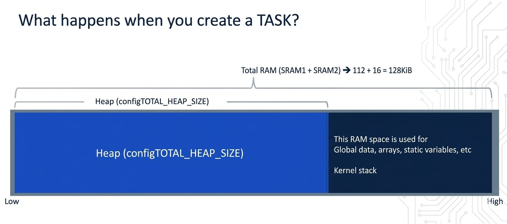
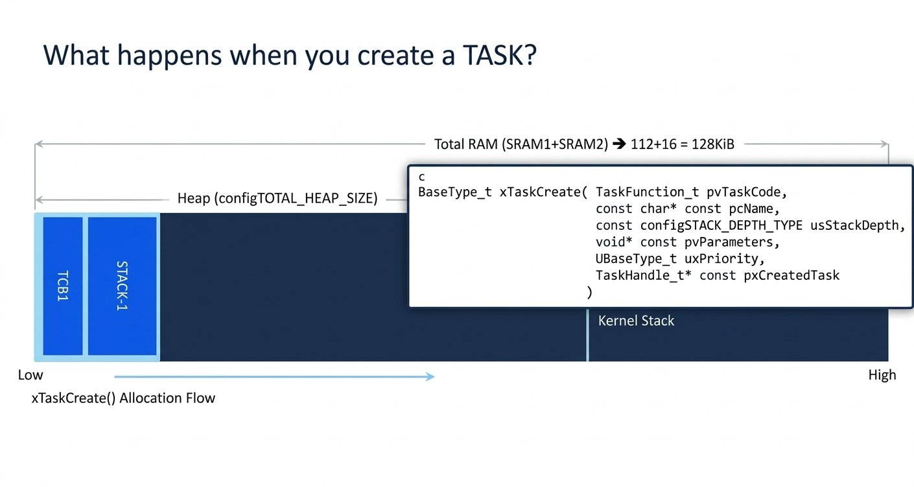
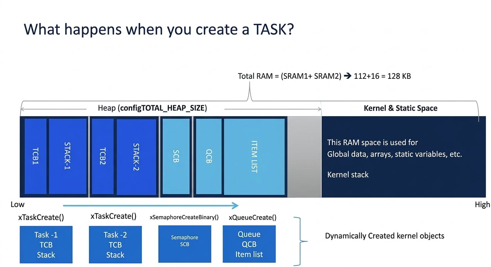
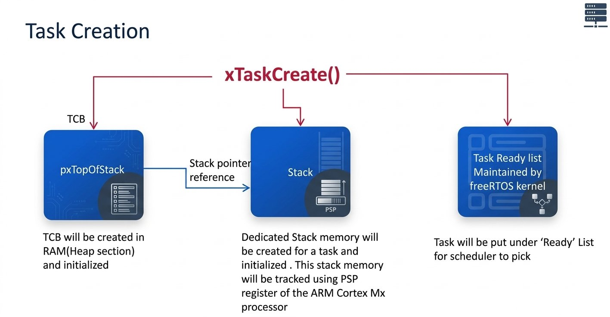

# FreeRTOS Heap Memory & Task Creation Internals

## 1. RAM and Heap Overview
- A microcontroller's total RAM can be made up of multiple SRAM regions. From the target Microcontroller:
  - `SRAM1` ≈ 112 KB
  - `SRAM2` ≈ 16 KB
  - **Total RAM** ≈ 128 KB (`SRAM1 + SRAM2`)
- This split and total size is **specific to the microcontroller being used** — a different target may have a different total RAM size and layout, so this number must always be checked per project/MCU.
- Out of the total RAM, FreeRTOS reserves a portion as its **heap** — the pool of memory the kernel dynamically allocates from (for task stacks, TCBs, and other kernel objects).
- The rest of the RAM (outside the FreeRTOS heap) is used for things like global data, global arrays, and static variables.



## 2. `configTOTAL_HEAP_SIZE`
- The amount of RAM reserved as the FreeRTOS heap is controlled by the `configTOTAL_HEAP_SIZE` configuration item in `FreeRTOSConfig.h`.

```c
// FreeRTOSConfig.h
#define configTOTAL_HEAP_SIZE   (15 * 1024)   // 15 KB reserved as FreeRTOS heap (example project value)
```

- This value can be increased or decreased as needed by the application.

## 3. Tuning the Heap Size for Your MCU
- Setting `configTOTAL_HEAP_SIZE` too high for the target's actual RAM causes a **build/link error** — the linker reports that some memory region "does not fit," i.e. RAM has overflowed by a certain number of bytes.
  - **Example** : Setting the heap to `130` KB on a target with `128` KB total RAM fails to build with this kind of overflow error.
  - Setting it to `100` KB on the same target builds successfully (though a project with a large amount of global data could still overflow RAM even at a heap size that would otherwise fit).
- This is a common issue when reusing example project settings across different microcontrollers: if a project's default `configTOTAL_HEAP_SIZE` (e.g. `75` KB) is carried over unchanged to a target with less RAM (e.g. `64` KB total), the same overflow build error results.

### NOTE :
**Rule of thumb:** always know your target microcontroller's actual total RAM before setting `configTOTAL_HEAP_SIZE`, and tune the value to fit within it — alongside whatever space the application's own globals and static data need.

## 4. What Consumes Heap Memory
- `xTaskCreate()` is not the only API that dynamically consumes FreeRTOS heap memory. Any API that creates a **kernel object** does the same:

| API | Kernel object created (allocated from heap) |
|---|---|
| `xTaskCreate()` | Task Control Block (TCB) + task's private stack |
| `xSemaphoreCreateBinary()` | Semaphore control block |
| `xQueueCreate()` | Queue control block + the queue's item storage (item list) |

- All such objects — TCBs, semaphore control blocks, queue control blocks, and so on — are collectively referred to as **kernel objects**, and memory for them is allocated dynamically whenever these creation APIs are used.





## 5. What `xTaskCreate()` Does With Heap Memory — 3 Steps
1. **Allocate memory for the TCB** from the heap.
   - The TCB (Task Control Block) is just a C structure with several member fields, which get initialized during creation.
   - One important member is `pxTopOfStack` (TopOfStack) — it holds the current top-of-stack location for the task's private stack.

```c
/* Simplified/illustrative — not the full kernel structure */
typedef struct tskTaskControlBlock
{
    volatile StackType_t *pxTopOfStack;  /* Points into the task's private stack */
    /* ... many other members (state lists, priority, name, etc.) ... */
} TCB_t;
```

2. **Allocate memory for the task's private stack** from the heap.
   - A dedicated stack is created and initialized for the task, sized according to the `usStackDepth` parameter passed to `xTaskCreate()`.
   - Usage of this private stack is tracked using the **PSP** register of the ARM Cortex-Mx processor.
   - The TCB's `pxTopOfStack` member points into this allocated stack memory.
3. **Add the TCB to the kernel's Ready list**, but only if *both* allocations above succeeded.
   - If either allocation fails (insufficient heap), `xTaskCreate()` does not create the task — it simply returns an error code indicating there wasn't enough heap memory.

## 6. Task Stack Tracking: PSP vs MSP
- The ARM Cortex-Mx processor has **two** stack pointers:
  - **MSP** — Main Stack Pointer.
  - **PSP** — Process Stack Pointer.
- A FreeRTOS task's private stack usage is tracked via the **PSP** register.



## 7. Where Heap Management Is Implemented
- The FreeRTOS heap itself is managed by a file typically named `heap_4.c`, located under:

```bash
    FreeRTOS/portable/MemMang/heap_4.c
```
- This file provides the FreeRTOS-flavored allocation functions, `pvPortMalloc()` and `vPortFree()` (the FreeRTOS equivalents of `malloc()`/`free()`), which all kernel object creation APIs use internally.

- Conceptually, the entire FreeRTOS heap is just a statically-declared byte array sized `configTOTAL_HEAP_SIZE`:

```c
    /* Inside heap_4.c — conceptual illustration */
    static uint8_t ucHeap[ configTOTAL_HEAP_SIZE ];
```

- `heap_4.c` manages allocation and freeing entirely within this array — whenever kernel code calls the FreeRTOS malloc function, the returned memory comes from this array.

### NOTE :
- FreeRTOS actually ships with several heap-management schemes to choose from (`heap_1.c` through `heap_5.c`), each with different trade-offs.

- `heap_1.c` supports allocation only (no freeing, simplest/most deterministic)

- `heap_4.c` supports both allocation and freeing along with coalescing of adjacent free blocks to reduce fragmentation.

- Which file is to be used is a build/project choice.

## Key Points
- Total heap available to FreeRTOS is set by `configTOTAL_HEAP_SIZE` in `FreeRTOSConfig.h`, and must be tuned to fit within the target microcontroller's actual total RAM (minus whatever space the application's own globals/statics need).
- `xTaskCreate()`, `xSemaphoreCreateBinary()`, `xQueueCreate()`, and similar APIs all dynamically allocate their respective kernel objects (TCB, semaphore control block, queue control block + storage) from this same heap.
- `xTaskCreate()` specifically allocates a TCB and a private stack from the heap, then adds the TCB to the Ready list only if both allocations succeed; otherwise it returns an insufficient-heap error.
- A task's private stack usage is tracked via the ARM Cortex-Mx **PSP** register, distinct from the **MSP** used for the main/exception stack.
- The heap itself is just a fixed-size byte array (sized `configTOTAL_HEAP_SIZE`) managed by `heap4.c`'s `pvPortMalloc()`/`vPortFree()` implementations.
